<h1>
   

   	 
   		
   	 
      
   

</h1>

   <strong>Visual designer and aspiring frontend developer driven to excel in this profession. Proficient in design software and web development tools and technologies. I have contributed to a
diverse range of projects and keep improving my abilities through research and work. <em>Based in Nuevo Vallarta, México. Working everywhere.</em>
</strong>

<h2>
   This is what I do better:
</h2>

<ul>
   <li>
      🎨 Branding & logo design.
   </li>
   <li>
      💻 User interface & product design.
   </li>
   <li>
      ⚙️ Implementing visual design in functional websites.
   </li>
   <li>
      👷🏽 Creating educational content for LATAM.
   </li>
   <li>
      🌮 The best fish tacos you'll try.
   </li>
</ul>

<h3>
   We can connect here:
</h3>

<h2>
   

      
      
      
      
   

</h2>

   

