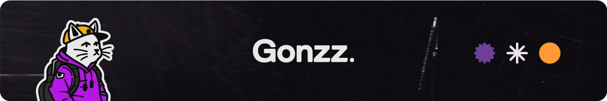

#  Hey there, I'm José Luis Gutiérrez.
**`Designer/Developer - I make stuff on the web`**

Self taught front-end developer and designer helping brands stand out. I like to provide creative solutions to technical problems and creating functional, beautiful designs. Based in **Nuevo Vallarta** and working **everywhere**.

## Things I do:
- 🎨 Visual Design - Logotype - Brand guidelines - Digital and printed assets
- 🛜 Web Design - Design system - Figma prototype
- 💻 Web development - Constant support
- 🌮 The best fish & shrimp tacos in town

### We can connect here:

   
   
   
      
   
      
   
   
   

